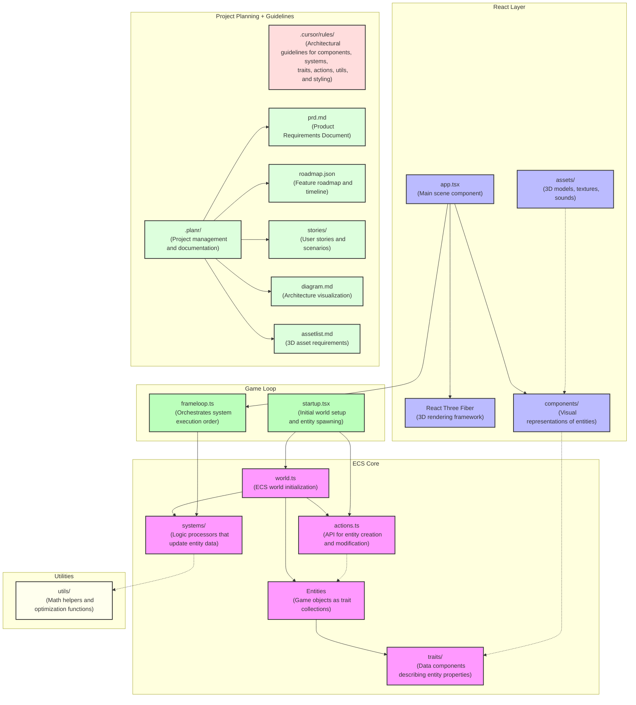

```mermaid
graph TD
    subgraph "ECS Core"
        World["world.ts
        (ECS world initialization)"]
        Entities["Entities
        (Game objects as trait collections)"]
        Traits["traits/
        (Data components describing entity properties)"]
        Systems["systems/
        (Logic processors that update entity data)"]
        Actions["actions.ts
        (API for entity creation and modification)"]
    end

    subgraph "React Layer"
        R3F["React Three Fiber
        (3D rendering framework)"]
        Components["components/
        (Visual representations of entities)"]
        Assets["assets/
        (3D models, textures, sounds)"]
        App["app.tsx
        (Main scene component)"]
    end

    subgraph "Game Loop"
        Frameloop["frameloop.ts
        (Orchestrates system execution order)"]
        Startup["startup.tsx
        (Initial world setup and entity spawning)"]
    end

    subgraph "Utilities"
        Utils["utils/
        (Math helpers and optimization functions)"]
    end
    
    subgraph "Project Planning + Guidelines"
        CursorRules[".cursor/rules/
        (Architectural guidelines for components, systems, 
        traits, actions, utils, and styling)"]
        PlanrDir[".planr/
        (Project management and documentation)"]
        PRD["prd.md
        (Product Requirements Document)"]
        Roadmap["roadmap.json
        (Feature roadmap and timeline)"]
        Stories["stories/
        (User stories and scenarios)"]
        Diagram["diagram.md
        (Architecture visualization)"]
        AssetList["assetlist.md
        (3D asset requirements)"]
    end

    %% Core Relationships
    World --> Entities
    Entities --> Traits
    World --> Systems
    World --> Actions
    
    %% System Dependencies
    Frameloop --> Systems
    
    %% Action Relationships
    Actions -.-> Entities
    
    %% Component Relationships
    Components -.-> Traits
    
    %% App Structure
    App --> R3F
    App --> Components
    App --> Frameloop
    
    %% Startup Flow
    Startup --> World
    Startup --> Actions
    
    %% Asset Usage
    Assets -.-> Components
    
    %% Systems use utilities
    Systems -.-> Utils
    
    %% Planr relationships
    PlanrDir --> PRD
    PlanrDir --> Roadmap
    PlanrDir --> Stories
    PlanrDir --> Diagram
    PlanrDir --> AssetList
    
    classDef core fill:#f9f,stroke:#333,stroke-width:2px
    classDef react fill:#bbf,stroke:#333,stroke-width:2px
    classDef loop fill:#bfb,stroke:#333,stroke-width:2px
    classDef util fill:#ffe,stroke:#333,stroke-width:2px
    classDef rules fill:#fdd,stroke:#333,stroke-width:2px
    classDef plan fill:#dfd,stroke:#333,stroke-width:2px
    
    class World,Entities,Traits,Systems,Actions core
    class R3F,Components,Assets,App react
    class Frameloop,Startup loop
    class Utils util
    class CursorRules rules
    class PlanrDir,PRD,Roadmap,Stories,Diagram,AssetList plan
```